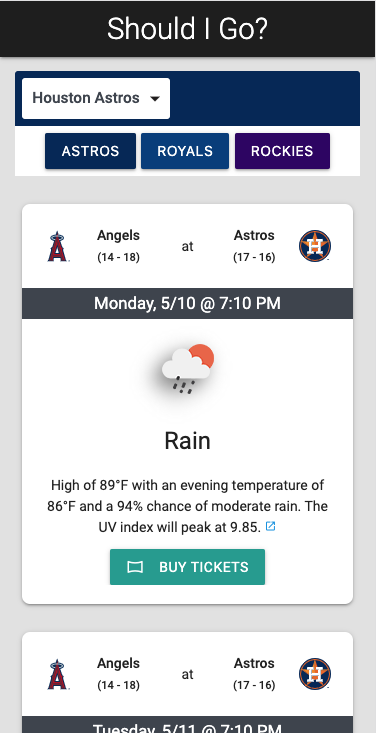

# Should I Go?
An app to help baseball fans decide whether to buy a ticket for an upcoming game. The app fetches and displays MLB team home game schedules from the MLB Stats API and corresponding weather information from OpenWeather's One Call API.

Try it: https://costanza13.github.io/should-i-go/

## Features/User Story
GIVEN I am a baseball fan, I WANT to see the weather forecast for upcoming games in my home team's city to help me decide if I should buy a ticket.

- WHEN I select a team 
THEN I am presented with the upcoming schedule of home games and the a weather overview for those days
- WHEN I view the schedule for a particular team 
THEN I see visual cues (color, icons) representing the team
- WHEN I view the game details 
THEN I can see the teams' records and a brief weather forecast to determing whether it's a good or bad day to go to a game
- WHEN I chose a team with no home games in the next 10 days 
THEN I see a message that there are no upcoming games
- WHEN I return to the site after leaving 
THEN I see results for my last viewed team, with an option to search for another team
- WHEN I decide I want to go to a game 
THEN I can click a link to the team web site to purchase tickets

## Screenshots
&nbsp;
  

